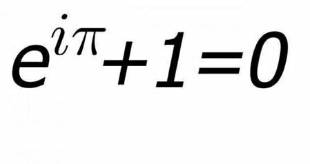
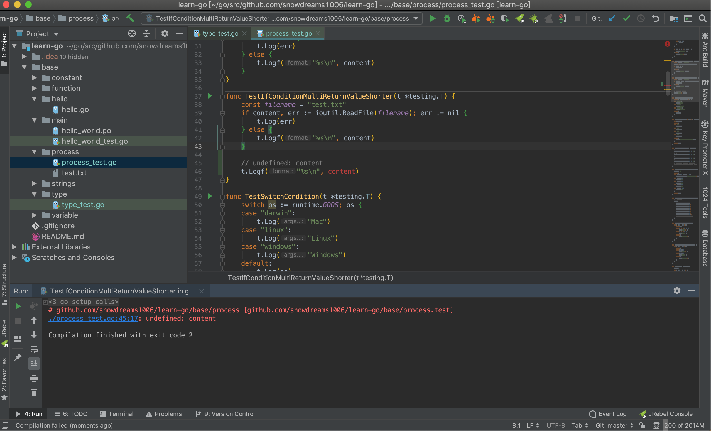

# 基础语法

在上篇文章中,我们动手亲自编写了第一个 `Go` 语言版本的 `Hello World`,并且认识了 `Go` 语言中有意思的变量和不安分的常量.

相信通过上篇文章的斐波那契数列,你已经初步掌握了 `Go` 语言的变量和常量与其他主要的编程语言的异同,为了接下来更好的学习和掌握 `Go` 的基础语法,下面先简单回顾一下变量和常量相关知识.

## 有意思的变量和不安分的常量

- 变量默认初始化有零值

```go
func TestVariableZeroValue(t *testing.T) {
    var a int
    var s string

    // 0
    t.Log(a, s)
    // 0 ""
    t.Logf("%d %q", a, s)
}
```

> `int` 类型的变量初始化默认零值是零 `0`,`string` 类型的变量默认初始化零值是空字符串 ` `,其他类型也有相应的零值.

- 多个变量可以同时赋值

```go
func TestVariableInitialValue(t *testing.T) {
    var a, b int = 1, 2
    var s string = "hello Go"

    // 1 2 hello Go
    t.Log(a, b, s)
}
```

> 其他主要的编程语言大多支持多个变量初始化,但极少数有像 `Go` 语言这样,不仅支持同时初始化,还可以同时赋值.

- 多个变量可以用小括号 `()` 统一定义

```go
func TestVariableShorter(t *testing.T) {
    var (
        a int    = 1
        b int    = 2
        s string = "hello go"
    )

    // 1 2 hello Go
    t.Log(a, b, s)
}
```

> 用小括号 `()` 方式,省略了相同的 `var` 关键字,看起来更加统一

- 变量类型可以被自动推断

```go
func TestVariableTypeDeduction(t *testing.T) {
    var a, b, s = 1, 2, "hello Go"

    // 1 2 hello Go
    t.Log(a, b, s)
}
```

> `Go` 语言可以根据变量值推测出变量类型,所以可以省略变量类型,再一次简化了变量定义,但是变量类型仍然是强类型,并不像 `Js` 那样的弱类型.

- 变量可以用 `:=` 形式更加简化

```go
func TestVariableTypeDeductionShorter(t *testing.T) {
    a, b, s := 1, 2, "hello Go"

    // 1 2 hello Go
    t.Log(a, b, s)

    s = "hello golang"

    // 1 2 hello golang
    t.Log(a, b, s)
}
```

> 省略了关键字 `var`,转而使用 `:=` 符号声明并初始化变量值且利用自动类型推断能力进一步就简化变量定义,再次赋值时不能再使用 `:=` 符号.

- 变量 `var` 声明作用域大于变量 `:=` 声明

```go
var globalTestId = 2
// globalTestName := "type_test" is not supported
var globalTestName = "type_test"

func TestVariableScope(t *testing.T) {
    // 2 type_test
    t.Log(globalTestId, globalTestName)

    globalTestName = "TestVariableScope"

    // 2 TestVariableScope
    t.Log(globalTestId, globalTestName)
}
```

> `var` 声明的变量可以作用于函数外或函数内,而 `:=` 声明的变量只能作用于函数内,`Go` 并没有全局变量的概念,变量的作用范围只是针对包而言.

- 常量的使用方式和变量一致

```go
func TestConstant(t *testing.T) {
    const a, b = 3, 4
    const s = "hello Go"

    // 3 4 hello Go
    t.Log(a, b, s)
}
```

> 常量声明关键字 `const`,常量和变量的使用方式一致,具备类型推断能力,也存在多种简化常量定义的形式.

- 虽然没有枚举类型,但可以用 `iota` 配合常量来实现枚举

```go
func TestConstant2Enum(t *testing.T) {
    const (
        java = iota
        golang
        cpp
        python
        javascript
    )
    // 0 1 2 3 4
    t.Log(java, golang,cpp,python,javascript)
}
```

> `iota` 在一组常量定义中首次出现时,其值为 `0`,应用到下一个常量时,其值为开始自增 `1`,再次遇到`iota` 恢复 `0` .效果非常像 `for` 循环中的循环索引 `i`,明明是常量,偏偏玩出了变量的味道,也是我觉得 `iota` 不安分的原因.

- 常量 `iota` 有妙用,还可以进行位运算

```go
func TestConstantIotaBitCalculate(t *testing.T){
    const (
        Readable = 1 << iota
        Writable
        Executable
    )
    // 0001 0010 0100 即 1 2 4
    t.Log(Readable, Writable, Executable)

    // 0111 即 7,表示可读,可写,可执行
    accessCode := 7
    t.Log(accessCode&Readable == Readable, accessCode&Writable == Writable, accessCode&Executable == Executable)
}
```

> 定义二进制位最低位为 `1` 时表示可读的,左移一位表示可写的,左移两位表示可执行的,按照按位与运算逻辑,目标权限位若拥有可读权限,此时和可读常量进行按位与运算之后的结果一定是可读的,由此可见,`iota` 非常适合此类操作.

总体来说,`Go` 语言中的变量很有意思,常量 `iota` 不那么安分,从上述归纳总结中不难看出,`Go` 语言和其他主流的编程语言还是有很大不同的,学习时要侧重于这些特殊之处.

> 如果想要回顾本节知识点,可以关注公众号[雪之梦技术驿站]找到[go 学习笔记之有意思的变量和不安分的常量](https://mp.weixin.qq.com/s/FBlMixqUjZ76CgMPg8fl6w) 这篇文章进行查看.

## 简洁的类型中格外关照了复数

在学习 `Go` 语言中的变量和常量时,虽然没有特意强调变量或常量的类型,但是大多数编程语言的类型基本都是差不多的,毕竟大家所处的现实世界是一样的嘛!

光是猜测是不够的,现在我们要梳理一遍 `Go` 语言的类型有哪些,和其他主流的编程语言相比有什么不同?

`Go` 语言的变量类型大致可以分为以下几种:

- `bool` 

> 布尔类型 `bool`,表示真假 `true|false`

- `(u)int` ,`(u)int8` , `(u)int16`, `(u)int32`,`(u)int64`,`uintptr`

> `int` 类型表示整数,虽然不带位数并不表示没有位数,`32` 位操作系统时长度为 `32` 位,`64` 位操作系统时长度为 `64` 位.最后一个 `uintptr` 是指针类型.

- `byte(uint8)` ,`rune(int32)`,`string`

> `byte` 是字节类型,也是 `uint8` 的别名,而 `rune` 是 `Go` 中的字符类型,也是 `int32` 的别名.

- `float32` ,`float64` ,`complex64` ,`complex128`

> 只有 `float` 类型表示小数,没有 `double` 类型,类型越少对于开发者而言越简单,不是吗? `complex64=float32+float32` 是复数类型,没错!就是高中数学书本上的复数,`3+4i` 那种奇怪的数字!

`Go` 的类型还是比较简单的,整数,小数,复数,字节,字符和布尔类型,相同种类的类型没有继续细分不同的名称而是直接根据类型长度进行命名的,这样是非常直观的,见名知意,根据数据大小直接选用类型,不费脑!

作为一种通用的编程语言,`Go` 内建类型中居然格外关照了复数这种数学概念类型,是一件有意思的事情,是不是意味着 `Go` 在工程化项目上做得更好?就像 `Go` 天生支持并发一样?

既然为数不多的类型中格外关照了复数类型,那我们简单使用下复数类型吧,毕竟其他类型和其他主流的编程语言相差不大.

```go
func TestComplex(t *testing.T) {
    c := 3 + 4i

    // 5
    t.Log(cmplx.Abs(c))
}
```

> 生命苦短,直接利用变量类型推断简化变量声明,求出复数类型 `c` 的模(绝对值)

既然学习了复数,怎么能少得了欧拉公式,毕竟是"世界上最美的公式",刚好用到了复数的相关知识,那我们就简单验证一下吧!



```go
func TestEuler(t *testing.T) {
    // (0+1.2246467991473515e-16i)
    t.Log(cmplx.Pow(math.E, 1i*math.Pi) + 1)

    // (0+1.2246467991473515e-16i)
    t.Log(cmplx.Exp(1i*math.Pi) + 1)

    // (0.000+0.000i)
    t.Logf("%.3f", cmplx.Exp(1i*math.Pi)+1)
}
```

> 由于复数 `complex` 是使用 `float` 类型表示的,而 `float` 类型无论是什么编程语言都是不准确的,所以欧拉公式的计算结果非常非常接近于零,当只保留小数点后三位时,计算结果便是 `(0.000+0.000i)` ,复数的模也就是 `0`,至此验证了欧拉公式.

## 看过复数还是要研究类型特点

复数很重要,但其他类型也很重要,简单了解过复数的相关知识后,我们仍然要把注意力放到研究这些内建类型的特殊之处上或者说这些类型总体来说相对于其他主流的编程语言有什么异同.

- 只有显示类型转换,不存在隐式类型转换

```go
func TestExplicitTypeConvert(t *testing.T) {
    var a, b int = 3, 4
    var c int
    c = int(math.Sqrt(float64(a*a + b*b)))

    // 3 4 5
    t.Log(a, b, c)
}
```

> 已知勾股定理的两条直角边计算斜边,根据勾股定理得,直角边长度的平方和再开根号即斜边长度,然而 `math.Sqrt` 方法接收的 `float64` 类型,返回的也是 `float64` 类型,可实际值全是 `int` 类型,这种情况下并不会自动进行类型转换,只能进行强制类型转换才能得到我们的期望值,这就是显示类型转换.

- 别名类型和原类型也不能进行隐式类型转换

```go
func TestImplicitTypeConvert2(t *testing.T) {
    type MyInt64 int64

    var a int64 = 1
    var b MyInt64

    // b = a : cannot use a (type int64) as type MyInt64 in assignment
    b = MyInt64(a)
    t.Log(a, b)
}
```

> `MyInt64` 是 `int64` 的别名,别名类型的 `b` 和原类型的 `a` 也不能进行也不能进行隐式类型转换,会报错 `cannot use a (type int64) as type MyInt64 in assignment`,只能进行显示类型转换.

- 支持指针类型,但不支持任何形式的计算

```go
func TestPointer(t *testing.T) {
    var a int = 1
    var pa *int = &a

    // 0xc0000921d0 1 1
    t.Log(pa, *pa, a)

    *pa = 2

    // 0xc0000901d0 2 2
    t.Log(pa, *pa, a)
}
```

> 同样的,指针类型也是其他编程语言反过来书写的,个人觉得这种反而不错,指向 `int` 类型的指针 `*int`,`&a` 是变量 `a` 的内存地址,所以变量 `pa` 存的就是变量 `a` 的地址,`*pa` 刚好也就是变量 `a` 的值.

上例显示声明了变量类型却没有利用到 `Go` 的类型推断能力,摆在那的能力却不利用简直是浪费,所以提供一种更简短的方式重写上述示例,并顺便解释后半句: "指针类型不支持任何形式的计算"

```go

func TestPointerShorter(t *testing.T) {
    a := 1
    pa := &a

    // 0xc0000e6010 1 1
    t.Log(pa, *pa, a)

    *pa = 2

    // 0xc0000e6010 2 2
    t.Log(pa, *pa, a)

    // pa = pa + 1 : invalid operation: pa + 1 (mismatched types *int and int)
    //pa = pa + 1

    // *int int int
    t.Logf("%T %T %T", pa, *pa,a)
}
```

> 变量 `pa` 是指针类型,存储的是变量的内存地址,只可远观而不可亵玩,`*pa` 就是指针所指向的变量的值,可以进行修改,当然没问题就像可以重新赋值变量 `a` 一样,但是指针 `pa` 是不可以进行任何形式的运算的,`pa = pa + 1` 就会报错 `invalid operation`.

## 你猜运算符操作有没有彩蛋呢

变量和类型还只是孤立的声明语句,没有计算不成逻辑,并不是所有的程序都是预定义的变量,`Go` 的运算符是简单还是复杂呢,让我们亲自体验一下!

- 算术运算符少了 `++i` 和 `--i`

```go
func TestArithmeticOperator(t *testing.T) {
    a := 0
    // 0
    t.Log(a)

    a = a + 1
    // 1
    t.Log(a)

    a = a * 2
    // 2
    t.Log(a)

    a = a % 2
    // 0
    t.Log(a)

    a++
    // 1
    t.Log(a)
}
```

> 支持大部分正常的运算符,不支持前置自增,前置自减,这也是好事,再也不会弄错 `i++` 和 `++i` 的运算结果啦,因为根本不支持 `++i` !

- 比较运算符是否相等有花样

```go
func TestComparisonOperator(t *testing.T) {
    a, b := 0, 1
    t.Log(a, b)

    // false true true
    t.Log(a > b, a < b, a != b)
}
```

> 大于,小于,不等于这种关系很正常,`Golang` 也没玩出新花样,和其他主流的编程语言逻辑一样,不用特别关心.但是关于比较数组 `==`,`Go` 表示有话要说!

`Go` 中的数组是可以进行比较的,当待比较的两个数组的维度和数组元素的个数相同时,两个数组元素顺序一致且相同时,则两个数组相等,而其他主流的编程语言一般而言比较的都是数组的引用,所以这一点需要特别注意.

```go
func TestCompareArray(t *testing.T) {
    a := [...]int{1, 2, 3}
    //b := [...]int{2, 4}
    c := [...]int{1, 2, 3}
    d := [...]int{1, 2, 4}

    // a == b --> invalid operation: a == b (mismatched types [3]int and [2]int)
    //t.Log(a == b)

    // true false
    t.Log(a == c,a == d)
}
```

> 数组 `a` 和 `c` 均是一维数组且元素个数都是 `3`,因此两个数组可以比较且相等,若数组`a` 和 `b` 进行比较,则报错 `invalid operation`,是因为两个数组的元素个数不相同,无法比较!

- 逻辑运算符老实本分无异常

```go
func TestLogicalOperator(t *testing.T) {
    a, b := true, false
    t.Log(a, b)

    // false true false true
    t.Log(a&&b,a||b,!a,!b)
}
```

- 位运算符新增按位清零 `&^` 很巧妙

`Go` 语言中定义按位清零运算符是 `&^`,计算规律如下:

当右边操作位数为 `1` 时,左边操作为不论是 `1` 还是 `0` ,结果均为 `0`;
当右边操作位数为 `0` 时,结果同左边操作位数.

```go
func TestClearZeroOperator(t *testing.T) {
    // 0 0 1 0
    t.Log(1&^1, 0&^1, 1&^0, 0&^1)
}
```

不知道还记不记得,在介绍常量 `iota` 时,曾经以文件权限为例,判断给定的权限码是否拥有特定权限,同样是给定的权限码,又该如何撤销特定权限呢?

```go
func TestClearZeroOperator(t *testing.T) {
    const (
        Readable = 1 << iota
        Writable
        Executable
    )
    // 0001 0010 0100 即 1 2 4
    t.Log(Readable, Writable, Executable)

    // 0111 即 7,表示可读,可写,可执行
    accessCode := 7
    t.Log(accessCode&Readable == Readable, accessCode&Writable == Writable, accessCode&Executable == Executable)

    // 0111 &^ 0001 = 0110 即清除可读权限
    accessCode = accessCode &^ Readable
    t.Log(accessCode&Readable == Readable, accessCode&Writing == Writing, accessCode&Executable == Executable)
}
```

> `accessCode = accessCode &^ Readable` 进行按位清零操作后就失去了可读权限,`accessCode&Readable == Readable` 再次判断时就没有可读权限了.

## 流程控制语句也有自己的傲娇

### `if` 有话要说

有了变量类型和各种运算符的加入,现在实现简单的语句已经不是问题了,如果再辅助流程控制语句,那么实现较为复杂拥有一定逻辑的语句便可更上一层楼.

`Go` 语言的 `if` 条件语句和其他主流的编程语言的语义是一样的,不一样的是书写规则和一些细节上有着自己特点.

- 条件表达式不需要小括号 `()`

```go
func TestIfCondition(t *testing.T) {
    for i := 0; i < 10; i++ {
        if i%2 == 0 {
            t.Log(i)
        }
    }
}
```

> `Go` 语言的各种省略形式使得整体上非常简洁,但也让拥有其他主流编程语言的开发者初次接触时很不习惯,语句结束不用分号 `;`,条件表达式不用小括号 `()` 等等细节,如果不用 `IDE` 的自动提示功能,这些细节肯定要耗费不少时间.

- 条件表达式中可以定义变量,只要最后的表达式结果是布尔类型即可

```go
func TestIfConditionMultiReturnValue(t *testing.T) {
    const filename = "test.txt"
    if content, err := ioutil.ReadFile(filename); err != nil {
        t.Log(err)
    } else {
        t.Logf("%s\n", content)
    }
}
```

> `Go` 语言的函数支持返回多个值,这一点稍后再细说,`ioutil.ReadFile` 函数返回文件内容和错误信息,当存在错误信息时 `err != nil`,输出错误信息,否则输出文件内容.

- 条件表达式中定义的变量作用域仅限于当前语句块



> 如果尝试在 `if` 语句块外访问变量 `content`,则报错 `undefined: content`

### `switch` 不甘示弱

同其他主流的编程语言相比,`switch` 语句最大的特点就是多个 `case` 不需要 `break`,`Go` 会自动进行 `break`,这一点很人性化.

- `switch` 会自动 `break`,除非使用 `fallthrough`

```go
func TestSwitchCondition(t *testing.T) {
    switch os := runtime.GOOS; os {
    case "darwin":
        t.Log("Mac")
    case "linux":
        t.Log("Linux")
    case "windows":
        t.Log("Windows")
    default:
        t.Log(os)
    }
}
```

- 条件表达式不限制为常量或整数

> 其他主流的编程语言中 `switch` 的条件表达式仅支持有限类型,使用方式存在一定局限性,`Go` 语言则不同,这一点变化也是很有意思的,使用 `switch` 做分支控制时不用担心变量类型了!

- `case` 语言支持多种条件,用逗号 `,` 分开,逻辑或

```go
func TestSwitchMultiCase(t *testing.T) {
    for i := 0; i < 10; i++ {
        switch i {
        case 0, 2, 4, 6, 8, 10:
            t.Log("Even", i)
        case 1, 3, 5, 7, 9:
            t.Log("odd", i)
        default:
            t.Log("default", i)
        }
    }
}
```

- 省略 `switch` 的条件表达式时,`switch` 的逻辑和多个 `if else` 逻辑相同

```go
func TestSwitchCaseCondition(t *testing.T) {
    for i := 0; i < 10; i++ {
        switch {
        case i%2 == 0:
            t.Log("Even", i)
        case i%2 == 1:
            t.Log("odd", i)
        default:
            t.Log("default", i)
        }
    }
}
```

### `for` 姗姗来迟

最后登场的是 `for` 循环,一个人完成了其他主流编程语言三个人的工作,`Go` 语言中既没有 `while` 循环也,也没有 `do while` 循环,有的只是 `for` 循环.

- 循环条件不需要小括号 `()`

```go
func TestForLoop(t *testing.T) {
    sum := 0
    for i := 1; i <= 100; i++ {
        sum += i
    }
    // 1+2+3+...+99+100=5050
    t.Log(sum)
}
```

> 再一次看到条件表达式不需要小括号 `()` 应该不会惊讶了吧? `if` 的条件语句表达式也是类似的,目前为止,接触到明确需要小括号的 `()` 也只有变量或常量定义时省略形式了.

- 可以省略初始条件

```go
func convert2Binary(n int) string {
    result := ""
    for ; n > 0; n /= 2 {
        lsb := n % 2
        result = strconv.Itoa(lsb) + result
    }
    return result
}

func TestConvert2Binary(t *testing.T) {
    // 1 100 101 1101
    t.Log(
        convert2Binary(1),
        convert2Binary(4),
        convert2Binary(5),
        convert2Binary(13),
    )
}
```

> 利用整数相除法,不断取余相除,得到给定整数的二进制字符串,这里就省略了初始条件,只有结束条件和递增表达式.这种写法同样在其他主流的编程语言是没有的,体现了 `Go` 设计的简洁性,这种特性在以后的编程中会越来越多的用到,既然可以省略初始条件,相信你也能猜到可不可以省略其他两个条件呢?

- 可以省略初始条件和递增表达式

```go
func printFile(filename string) {
    if file, err := os.Open(filename); err != nil {
        panic(err)
    } else {
        scanner := bufio.NewScanner(file)
        for scanner.Scan() {
            fmt.Println(scanner.Text())
        }
    }
}

func TestPrintFile(t *testing.T) {
    const filename = "test.txt"
    printFile(filename)
}
```

> 打开文件并逐行读取内容,其中 `scanner.Scan()` 的返回值类型是 `bool`,这里省略了循环的初始条件和递增表达式,只有循环的终止条件,也顺便实现了 `while` 循环的效果.

- 初始条件,终止条件和递增表达式可以全部省略

```go
func forever() {
    for {
        fmt.Println("hello go")
    }
}

func TestForever(t *testing.T) {
    forever()
}
```

> `for` 循环中没有任何表达式,意味着这是一个死循环,常用于 `Web` 请求中监控服务端口,是不是比 `while(true)` 要更加简单?

## 压轴的一等公民函数隆重登场

虽然没有特意强制函数,但是示例代码中全部都是以函数形式给出的,函数是封装的一种形式,更是 `Go` 语言的一等公民.

- 返回值在函数声明的最后,多个返回值时用小括号 `()`

```go
func eval(a, b int, op string) int {
    var result int
    switch op {
    case "+":
        result = a + b
    case "-":
        result = a - b
    case "*":
        result = a * b
    case "/":
        result = a / b
    default:
        panic("unsupported operator: " + op)
    }
    return result
}

func TestEval(t *testing.T) {
    t.Log(
        eval(1, 2, "+"),
        eval(1, 2, "-"),
        eval(1, 2, "*"),
        eval(1, 2, "/"),
        //eval(1, 2, "%"),
    )
}
```

> 不论是变量的定义还是函数的定义,`Go` 总是和其他主流的编程语言相反,个人觉得挺符合思维顺序,毕竟都是先有输入才能输出,多个输出当然要统一隔离在一块了.

- 可以有零个或一个或多个返回值

```go
func divide(a, b int) (int, int) {
    return a / b, a % b
}

func TestDivide(t *testing.T) {
    // 2 1
    t.Log(divide(5, 2))
}
```

> 小学时就知道两个整数相除,除不尽的情况下还有余数.只不过编程中商和余数都是分别计算的,`Go` 语言支持返回多个结果,终于可以实现小学除法了!

- 返回多个结果时可以给返回值起名字

```go

func divideReturnName(a, b int) (q, r int) {
    return a / b, a % b
}

func TestDivideReturnName(t *testing.T) {
    q, r := divideReturnName(5, 2)

    // 2 1
    t.Log(q, r)
}
```

> 还是整数除法的示例,只不过给返回值起了变量名称 `(q, r int)`,但这并不影响调用者,某些 `IDE` 可能会基于次特性自动进行代码补全,调用者接收时的变量名不一定非要是 `q,r` .

- 其他函数可以作为当前函数的参数

```go
func apply(op func(int, int) int, a, b int) int {
    p := reflect.ValueOf(op).Pointer()
    opName := runtime.FuncForPC(p).Name()

    fmt.Printf("Calling function %s with args (%d,%d)\n", opName, a, b)
    return op(a, b)
}

func pow(a, b int) int {
    return int(math.Pow(float64(a), float64(b)))
}

func TestApply(t *testing.T) {
    // 1
    t.Log(apply(func(a int, b int) int {
        return a % b
    }, 5, 2))

    // 25
    t.Log(apply(pow, 5, 2))
}
```

> `apply` 函数的第一个参数是 `op` 函数,第二,第三个参数是 `int` 类型的 `a,b`.其中 `op` 函数也接收两个 `int` 参数,返回一个 `int` 结果,因此 `apply` 函数的功能就是将 `a,b` 参数传递给 `op` 函数去执行,这种方式比 `switch` 固定运算类型要灵活方便!

- 没有默认参数,可选参数等复杂概念,只有可变参数列表

```go
func sum(numbers ...int) int {
    result := 0
    for i := range numbers {
        result += numbers[i]
    }
    return result
}

func TestSum(t *testing.T) {
    // 15
    t.Log(sum(1, 2, 3, 4, 5))
}
```

> `range` 遍历方式后续再说,这里可以简单理解为其他主流编程语言中的 `foreach` 循环,一般包括当前循环索引和循环项.

## 指针类型很方便同时也很简单

`Go` 的语言整体上比较简单,没有太多花里胡哨的语法,稍微有点特殊的当属变量的定义方式了,由于具备类型推断能力,定义变量的方式有点多,反而觉得选择困难症,不知道这种情况后续会不会有所改变?

在 `Go` 语言的为数不多的类型中就有指针类型,指针本来是 `c` 语言的概念,其他主流的编程语言也有类似的概念,可能不叫做指针而是引用,但 `Go` 语言的发展和 `c++` 有一定关系,保留了指针的概念.

但是这并不意味着 `Go` 语言的指针像 `C` 语言那样复杂,相反,`Go` 语言的指针很方便也很简单,方便是由于提供我们操作内存地址的方式,简单是因为不能对指针做任何运算!

简单回忆一下指针的基本使用方法:

```go
func TestPointerShorter(t *testing.T) {
    a := 1
    pa := &a

    // 0xc0000e6010 1 1
    t.Log(pa, *pa, a)

    *pa = 2

    // 0xc0000e6010 2 2
    t.Log(pa, *pa, a)

    // pa = pa + 1 : invalid operation: pa + 1 (mismatched types *int and int)
    //pa = pa + 1

    // *int int int
    t.Logf("%T %T %T", pa, *pa,a)
}
```

> `&` 可以获取变量的指针类型,`*` 指向变量,但不可以对指针进行运算,所以指针很简单!

当指针类型和其他类型和函数一起发生化学反应时,我们可能更加关心参数传递问题,其他主流的编程语言可能有值传递和引用传递两种方式,`Go` 语言进行参数传递时又是如何表现的呢?

```go
func swapByVal(a, b int) {
    a, b = b, a
}

func TestSwapByVal(t *testing.T) {
    a, b := 3, 4

    swapByVal(a, b)

    // 3 4
    t.Log(a, b)
}
```

> `swapByVal` 函数内部实现了变量交换的逻辑,但外部函数 `TestSwapByVal` 调用后变量 `a,b` 并没有改变,可见 `Go` 语言这种参数传递是值传递而不是引用传递.

上面示例中参数传递的类型都是普通类型,如果参数是指针类型的话,结果会不会不一样呢?

```go
func swapByRef(a, b *int) {
    *a, *b = *b, *a
}

func TestSwapByRef(t *testing.T) {
    a, b := 3, 4

    swapByRef(&a, &b)

    // 4 3
    t.Log(a, b)
}
```

> 指针类型进行参数传递时可以交换变量的值,拷贝的是内存地址,更改内存地址的指向实现了原始变量的交换,参数传递的仍然是值类型.

实际上,`Go` 语言进行参数传递的只有值类型一种,这一点不像其他主流的编程语言那样可能既存在值类型又存在引用类型.

既然是值类型进行参数传递,也就意味着参数传递时直接拷贝一份变量供函数调用,函数内部如何修改参数并不会影响到调用者的原始数据.

如果只是简单类型并且不希望参数值被修改,那最好不过,如果希望参数值被修改呢?那只能像上例那样传递指针类型.

简单类型不论是传递普通类型还是指针类型,变量的拷贝过程不会太耗费内存也不会影响状态.

如果传递的参数本身是比较复杂的类型,仍然进行变量拷贝过程估计就不能满足特定需求了,可能会设计成出传递复杂对象的某种内部指针,不然真的要进行值传递,那还怎么玩?

`Go` 只有值传递一种方式,虽然简单,但实际中如何使用应该有特殊技巧,以后再具体分析,现在回到交换变量的例子,换一种思路.

```go
func swap(a, b int) (int, int) {
    return b, a
}

func TestSwap(t *testing.T) {
    a, b := 3, 4

    a, b = swap(a, b)

    // 4 3
    t.Log(a, b)
}
```

> 利用 `Go` 函数可以返回多个值特性,返回交换后的变量值,调用者接收时相当于重新赋值,比传递指针类型要简单不少!

## 基础语法知识总结和下文预告

刚刚接触 `Go` 语言时觉得 `Go` 的语言很简单也很特别,和其他主流的编程语言相比,有着自己独特的想法.

语句结束不用分号 `;` 而是直接回车换行,这一点有些不习惯,好在强大的 `IDE` 可以纠正这些细节.

变量声明时变量名在前,变量类型在后,可能更加符合大脑思维,但是习惯了先写变量类型再写变量名,这确实有一定程度的不方便,后来索性不写变量类型,自然就没有问题了.

函数声明同变量声明类似,返回值放到了最后部分,并且还可以有多个返回值,经过了变量的洗礼,再熟悉函数的这一特点也就不那么惊讶了,先输入后输出,想一想也有道理,难道其他编程语言的顺序都是错的?

接下来就是语法的细节,比如 `if` 的条件表达式可以进行变量赋值,`switch` 表达式可以不用 `break`,只有 `for` 循环一种形式等等.

这些细节总体来说比较简单方便,不用关心细节,放心大胆使用,从而专注于业务逻辑,等到语法不对时,`IDE` 自然会给出相应的报错提醒,放心大胆 `Go` !

本文主要介绍了 `Go` 的基本语法以及和其他主流的编程语言的异同,你 `Get` 到了吗?

下文将开始介绍 `Go` 的内建容器类型,数组,切片,`Map` 来一遍!

欢迎大家一起学习交流,如有不当之处,恳请指正,如需完整源码,请在公众号[雪之梦技术驿站]留言回复,感谢你的评论与转发!