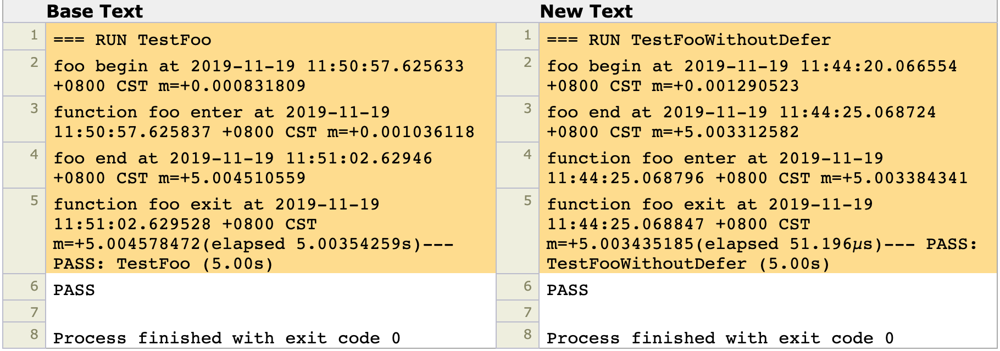

# 延迟函数

## 温故知新不忘延迟基础


```
A "defer" statement invokes a function whose execution is deferred to the moment the surrounding function returns, either because the surrounding function executed a return statement, reached the end of its function body, or because the corresponding goroutine is panicking.
```

延迟函数的**运行时机**一般有三种情况:

- 周围函数遇到返回时

```go
func funcWithMultipleDeferAndReturn() {
    defer fmt.Println(1)
    defer fmt.Println(2)
    fmt.Println(3)
    return
    fmt.Println(4)
}
```

> 运行结果: `3 2 1` .
> 
> 「雪之梦技术驿站」: `defer fmt.Println(1)` 和 `defer fmt.Println(2)` 两个语句由于前面存在 `defer` 关键字,因此均**被延迟**到正常语句 `return` 前.当多个 `defer` 语句均被延迟时,倒序执行延迟语句,这种特点非常类似于数据结构的**栈**(先入后出).所以依次输出 `fmt.Println(3)` ,`defer fmt.Println(2)` ,`defer fmt.Println(1)` .

- 周围函数函数体结尾处

```go
func funcWithMultipleDeferAndEnd() {
    defer fmt.Println(1)
    defer fmt.Println(2)
    fmt.Println(3)
}
```

> 运行结果: `3 2 1` .
>
> 「雪之梦技术驿站」: 比 `funcWithMultipleDeferAndReturn` 示例简单一些,虽然包围函数 `funcWithMultipleDeferAndEnd` 并没有显示声明 `return` 语句,但是当函数运行结束前依然不会忘记执行延迟语句.所以 `fmt.Println(3)` 执行完后,程序并没有立即结束而是紧接着执行延迟语句 `defer fmt.Println(2)` 和 `defer fmt.Println(1)`.

- 当前协程惊慌失措中

```go
func funcWithMultipleDeferAndPanic() {
    defer fmt.Println(1)
    defer fmt.Println(2)
    fmt.Println(3)
    panic("panic")
    fmt.Println(4)
}
```

> 运行结果: `3 2 1` .
>
> 「雪之梦技术驿站」: 和 `funcWithMultipleDeferAndReturn` 示例有点类似,只不过由原来的 `return` 语句换成了 `panic("panic")`. 我们知道延迟语句 `defer fmt.Println(1)` 和 `defer fmt.Println(2)` 肯定会被延迟执行,所以并不会先输出 `1,2` 而是先执行了 `fmt.Println(3)` ,下一步就遇到了 `panic("panic")` ,此时顾不上惊慌失措,先让已存在的 `defer` 语句先执行再说!
> 同时,`defer` 是倒序执行的,因而先输出 `defer fmt.Println(2)` 再输出 `defer fmt.Println(1)` ,最后完成使命,光荣挂掉,至于 `fmt.Println(4)` 就无法执行了!

关于这一句话的详细解读,请参考 [go 学习笔记之解读什么是defer延迟函数](https://mp.weixin.qq.com/s/XttOuCEk7kgySKLOCqVMRQ),示例源码见 [snowdreams1006/learn-go/tree/master/error](https://github.com/snowdreams1006/learn-go/tree/master/error)

如果你真的试图去理解 `defer` 的**执行时机**,最好看一下**汇编代码**的具体实现,推荐一下大佬的 [defer关键字](https://tiancaiamao.gitbooks.io/go-internals/content/zh/03.4.html)

关于 `defer` 关键字相关解释,摘录如下: 

> 当函数包含 `defer` 语句,则汇编代码:

> c
> call runtime.deferreturn，
> add xx SP
> return

> `goroutine` 的控制结构中,有一张表记录 `defer` ,调用 `runtime.deferproc` 时会将需要 `defer` 的表达式记录在表中,而在调用 `runtime.deferreturn` 的时候，则会依次从 `defer` 表中出栈并执行。

但是,从语义上理解会更加简单,问一下自己为什么需要 `defer` 关键字,到底解决了什么问题?


一旦理解了 `defer` 关键字的实现意图,那么自然而然就能大概猜出有关执行顺序,所以何必深究实现细节呢?

简而言之,`defer` 关键字是确保程序一定会执行的代码逻辑,不管程序是正常 `return` 还是意外 `panic` ,包围函数一旦存在 `defer` 关键字就要保证延迟函数一定执行!

当存在多个 `defer` 关键字时,意味着有多个紧急任务需要处理,时间紧迫,当然是事故发生点最近的优先执行,离`return` 或 `panic` 越远的越晚执行.

所以**以防万一和就近原则**是理解 `defer` 执行时机的最佳途径: 万一哪天发生火灾,第一反应自然是就近救人啊!


## 支持什么又不支持哪些

```
The expression must be a function or method call; it cannot be parenthesized. Calls of built-in functions are restricted as for expression statements.
```

- 支持函数调用

```go
func funcCallWithDefer() {
    fmt.Println("funcInvokeWithDefer function is called")
}

func TestFuncCallWithDefer(t *testing.T) {
    // 「雪之梦技术驿站」: defer 语句可以是函数调用.
    fmt.Println(" 「雪之梦技术驿站」: defer 语句可以是函数调用.")

    defer funcCallWithDefer()

    fmt.Println("TestFuncInvokeWithDefer function call has ended")
}
```

- 支持方法调用

```go
type Lang struct {
    name    string
    website string
}

func (l *Lang) ToString() {
    fmt.Printf("Lang:[name = %s,website = %s] \n", l.name, l.website)
}

func TestMethodCallWithDefer(t *testing.T) {
    // 「雪之梦技术驿站」: defer 语句也可以是方法调用.
    fmt.Println(" 「雪之梦技术驿站」: defer 语句也可以是方法调用.")

    var l = new(Lang)
    l.name = "Go"
    l.website = "https://snowdreams1006.github.io/go/"

    defer l.ToString()

    fmt.Println("TestMethodCallWithDefer method call has ended")
}
```

- 不可以被括号包裹


- 内建函数和表达式一样受限

|函数名|说明|说明|
|:-:|:-:|:-:|
|close|关闭channel|仅用于channel通讯|
|delete|从map中删除实例|map操作|
|len|返回字符串，slice和数组的长度|可用于不同的类型|
|cap|返回容量|可用于不同的类型|
|new|内存分配|用于各种类型|
|make|内存分配|仅用于chan/slice/map|
|copy|复制slice|slice操作|
|append|追加slice|slice操作|
|panic|报告运行时问题|异常处理机制|
|recover|处理运行时问题|异常处理机制|
|print|内建打印函数|主要用于不引入fmt的时候的调试，实际使用时建议使用标准库fmt|
|println|内建打印函数|主要用于不引入fmt的时候的调试，实际使用时建议使用标准库fmt|
|complex|构造复数类型|复数操作|
|real|抽出复数的实部|复数操作|
|imag|抽出复数的虚部|复数操作|

```go
func TestBuiltinFuncCallWithDefer(t *testing.T) {
    // 「雪之梦技术驿站」: defer 语句不可以被括号包裹.
    fmt.Println(" 「雪之梦技术驿站」: defer 语句不可以被括号包裹.")

    arr := new([10]int)
    arr[4] = 5
    arr[7] = 8

    // defer discards result of len(arr)
    defer len(arr)
    defer println("Calls of built-in functions are restricted as for expression statements.")

    fmt.Println("TestBuiltinFuncCallWithDefer function call has ended")
}
```

## 咬文嚼字深入理解延迟

```
Each time a "defer" statement executes, the function value and parameters to the call are evaluated as usual and saved anew but the actual function is not invoked. Instead, deferred functions are invoked immediately before the surrounding function returns, in the reverse order they were deferred. That is, if the surrounding function returns through an explicit return statement, deferred functions are executed after any result parameters are set by that return statement but before the function returns to its caller. If a deferred function value evaluates to nil, execution panics when the function is invoked, not when the "defer" statement is executed.
```

### 打蛇打七寸


> Each time a "defer" statement executes, **the function value and parameters to the call are evaluated as usual and saved anew but the actual function is not invoked**.

Each time a "defer" statement executes, **the function value and parameters to the call are evaluated as usual and saved anew but the actual function is not invoked**.

每次延迟语句执行时,函数值和调用参数会像以往一样被评估和保存,但是实际函数并不会被调用.

```go
func trace(funcName string) func(){
    start := time.Now()
    fmt.Printf("function %s enter at %s \n",funcName,start)

    return func(){
        fmt.Printf("function %s exit at %s(elapsed %s)",funcName,time.Now(),time.Since(start))
    }
}

func foo(){
    fmt.Printf("foo begin at %s \n",time.Now())

    defer trace("foo")()
    time.Sleep(5*time.Second)

    fmt.Printf("foo end at %s \n",time.Now())
}

func TestFoo(t *testing.T) {
    foo()
}
```

`trace` 函数实现了**函数计时**功能,而 `foo` 函数则是包围函数用于演示 `defer` 关键字的逻辑,`TestFoo` 是测试函数,输出测试结果.

测试结果如下:

> === RUN   TestFoo
> foo begin at 2019-11-18 23:12:38.519097 +0800 CST m=+0.000735902 
> function foo enter at 2019-11-18 23:12:38.519287 +0800 CST m=+0.000926011 
> foo end at 2019-11-18 23:12:43.524445 +0800 CST m=+5.005934027 
> function foo exit at 2019-11-18 23:12:43.524549 +0800 CST m=+5.006038281(elapsed > 5.005112612s)--- PASS: TestFoo (5.01s)
> PASS
> 
> Process finished with exit code 0

如果此时试图去解释上述运行结果,很遗憾铩羽而归!


记得官方文档中关于 `defer` 描述的第一句话就阐明了**延迟函数的执行时机**,原文如下:

```
A "defer" statement invokes a function whose execution is deferred to the moment the surrounding function returns, either because the surrounding function executed a return statement, reached the end of its function body, or because the corresponding goroutine is panicking.
```

但是如果按照这句话来解释此次示例的运行结果,显然是解释不通的!

```go
func foo(){
    fmt.Printf("foo begin at %s \n",time.Now())

    defer trace("foo")()
    time.Sleep(5*time.Second)

    fmt.Printf("foo end at %s \n",time.Now())
}

func TestFoo(t *testing.T) {
    foo()
}
```

如果 `defer trace("foo")()` 延迟函数真的被延迟到**函数体结束之前**,那么上述 `foo()` 函数应该等价于这种形式:

```go
func fooWithoutDefer(){
    fmt.Printf("foo begin at %s \n",time.Now())

    time.Sleep(5*time.Second)

    fmt.Printf("foo end at %s \n",time.Now())

    trace("foo")()
}

func TestFooWithoutDefer(t *testing.T) {
    fooWithoutDefer()
}
```

但是对于 `fooWithoutDefer` 函数的执行结果直接实力打脸:

> === RUN   TestFooWithoutDefer
> foo begin at 2019-11-19 11:44:20.066554 +0800 CST m=+0.001290523 
> foo end at 2019-11-19 11:44:25.068724 +0800 CST m=+5.003312582 
> function foo enter at 2019-11-19 11:44:25.068796 +0800 CST m=+5.003384341 
> function foo exit at 2019-11-19 11:44:25.068847 +0800 CST m=+5.003435185(elapsed 51.196µs)--- PASS: TestFooWithoutDefer (5.00s)
> PASS
>
> Process finished with exit code 0

由此可见,延迟函数其实并不简单,想要弄清楚 `defer` 关键字还要继续读下去才有可能!



这一点也是我最大的疑惑,潜意识告诉我: 只要无法真正理解 `Each time a "defer" statement executes, the function value and parameters to the call are evaluated as usual and saved anew but the actual function is not invoked.` 这句话的含义,那么永远不可能彻底弄清 `defer` 关键字!

通过直接调换 `defer` 语句的出现位置并没有解释测试结果,反而告诉我们 `defer` 语句可不是简简单单的延迟执行.

任何函数都会或多或少依赖相应的执行环境,`defer` 延迟函数也不例外,在本示例中 `defer trace("foo")()` 延迟函数的 `trace("foo")` 函数的返回值是函数,然后 `trace("foo")()` 相当于立即执行返回函数,因而问题可能出现在 `trace("foo")` 函数中,那么不妨继续看看吧!

```go
func foo(){
    fmt.Printf("foo begin at %s \n",time.Now())

    defer trace("foo")()
    time.Sleep(5*time.Second)

    fmt.Printf("foo end at %s \n",time.Now())
}

func trace(funcName string) func(){
    start := time.Now()
    fmt.Printf("function %s enter at %s \n",funcName,start)

    return func(){
        fmt.Printf("function %s exit at %s(elapsed %s)",funcName,time.Now(),time.Since(start))
    }
}
```

`1. foo begin at 2019-11-19 14:06:42.385982 +0800 CST m=+0.000943615` 暗示着已经开始进入 `foo()` 函数内部,接下来的 `function foo enter at 2019-11-19 14:06:42.38623 +0800 CST m=+0.001191025 ` 意味着函数并没有执行 `time.Sleep(5*time.Second)` 而是直接进入了 `defer trace("foo")()` 语句内部,可见函数依旧是顺序执行,但是 `trace(funcName string) func()` 函数内部会返回函数,此时函数返回值并没有执行,因为此时并不存在打印输出的日志.

所以 `trace(funcName string) func()` 函数应该是已经执行了,接下来返回上一层回到主函数 `foo()` 就遇到了 `time.Sleep(5*time.Second)` 休息 `5s` 语句,所以在执行 `fmt.Printf("foo end at %s \n",time.Now())` 语句时输出的时间和最近的上一句差了大概 `5s` .

`foo end at 2019-11-19 14:06:47.391581 +0800 CST m=+5.006394415` 输出后也就意味着 `foo()` 函数运行到包围函数的结束处,此时按照延迟语句的第一句,我们知道是时候执行真正的延迟逻辑了.

所以下一句就是 `trace("foo")()` 的函数返回值的调用,输出了 `function foo exit at 2019-11-19 14:06:47.391706 +0800 CST m=+5.006518615(elapsed 5.005327927s)--- PASS: TestFoo (5.01s)`

至此,延迟函数执行完毕,单元测试函数也输出了 `PASS` .

```
=== RUN   TestFoo
foo begin at 2019-11-19 14:06:42.385982 +0800 CST m=+0.000943615 
function foo enter at 2019-11-19 14:06:42.38623 +0800 CST m=+0.001191025 
foo end at 2019-11-19 14:06:47.391581 +0800 CST m=+5.006394415 
function foo exit at 2019-11-19 14:06:47.391706 +0800 CST m=+5.006518615(elapsed 5.005327927s)--- PASS: TestFoo (5.01s)
PASS
```

通过上述分析,可以这么理解,延迟函数也是需要执行环境的,而执行环境就是依赖于定义 `defer` 语句时的相关环境,这也就是延迟函数的**准备阶段**或者说**入栈**.

当遇到包围函数体返回时或到达包围函数体结尾处或发生错误时,包围函数就会调用已存在的延迟函数,这部分就是延迟函数的**执行阶段**或者说**出栈**.

- 无论是否存在延迟函数,均**顺序执行**函数逻辑
- 准备阶段的入栈操作会正常运行但**不会调用函数**
- 执行阶段的出栈操作在**合适时机时会调用函数**

同样地,仍然以消防队员作为 `Go` 的调度器,平民百姓作为无 `defer` 保护的对比参考,而有 `defer` 保护的特殊人群作为延迟函数.

有一天,普通百姓和特殊人士都在商场逛街,突发火灾,附近消防员迅速赶紧救人,任务只要一个:那就是按照**就近原则快速救出**全部特殊人群,因为这些特殊人群都是有头有脸的人物,每个人都有自己的脾气个性.

明星 A : 我进商场前拿着限量版的 `LV` 包包,这个我也要拿出去!
富二代 B : 我进商场前答应小女友要给他买个礼物,这个是寄存柜地址,别忘了把礼物也带回来!
暴发户 C : 我在商场有个保险柜,存放了大量金条,一定要给我带出去!

消防员很无奈,心里咒骂了一句: 这都生死攸关了,还管什么身外之物啊!

可是,埋怨归埋怨,对于这些特殊人群的照顾,那是一丁点也不敢怠慢,只能照办,终于全部救出了!

> A 表示声明 `defer` 语句时已经传递了参数,等到执行 `defer` 时调用的就是刚才的参数值,而 `Go` 语言中参数的传递只能是**值传递**,所以虽然看起来还是那个包,其实已经变了,这里并不是特别准确!
> B 表示声明 `defer` 语句时传递的参数不是具体值而是引用,当执行 `defer` 逻辑时会按图索骥,因此虽然给的是一张寄存柜的密码纸,最后拿出来的却是存在柜子里的礼物.
> C 表示声明 `defer` 时什么都没有传递,没有任何入参但是执行 `defer` 语句中遇到了访问包围函数的需求,这时候延迟函数会扩大搜索范围向上寻找直到找到商场的金库为止.

- 零依赖而无顾虑

```go
func deferWithoutParams() {
    // 2 1
    defer fmt.Println(1)
    fmt.Println(2)
}
```

> 「雪之梦技术驿站」: 入栈时没有任何依赖,出栈时也不会有任何顾虑,非常简单直观输出了 `2 1` .

- 随身携带的牵挂

```go
func deferWithValueParams() {
    x := 10
    defer func(n int) {
        // 10
        fmt.Println(n)
    }(x)
    x++
}
```

> 「雪之梦技术驿站」: 入栈时存在值参数 `func(n int)(10)`,出栈时需要输出参数的值,而 `fmt.Println(n)` 涉及到的 `n` 刚好保存在入栈环境中,所以等到 `deferWithValueParams` 运行到函数结束后输出的结果就是已缓存的副本 `10` .

如果此时匿名函数调用的不是 `n` 而是 `x`,而变量 `x` 并不存在于入栈环境中,此时就会继续扩大范围搜到 `deferWithValueParams` 函数是否存在变量 `x` 的声明,本示例中找到的 `x=11`.

```go
func deferWithOuterParams() {
    x := 10
    defer func(n int) {
        // 11
        fmt.Println(x)
    }(x)
    x++
}
```

- 心有牵挂放不下

```go
func deferWithReferParams() {
    x := 10
    defer func(n *int) {
        // 11
        fmt.Println(*n)
    }(&x)
    x++
}
```

> 「雪之梦技术驿站」: 入栈时保存的不再是值而是地址,因此出栈时会按图索骥,找到该地址对应的值,也就是 `11` .

相信以上案例应该帮助读者理解 `defer` 语句的一些注意事项了吧?

延迟函数准备阶段的入栈会收集函数运行所需的环境依赖,比如说入参的值,收集结束后即使外界再改变该值也不会影响延迟函数,因为延迟函数用的是缓存副本啊!

### 出栈会倒序

> Instead, **deferred functions are invoked immediately** before the surrounding function returns, **in the reverse order they were deferred**.

相反的,延迟函数会在包围函数返回之前按照被延迟顺序逆序调用.

```go
func TestFuncWithMultipleDefer(t *testing.T) {
    // 「雪之梦技术驿站」: 猜测 defer 底层实现数据结构可能是栈,先进后出.
    t.Log(" 「雪之梦技术驿站」: 猜测 defer 底层实现数据结构可能是栈,先进后出.")

    // 3 2 1
    defer t.Log(1)
    defer t.Log(2)
    t.Log(3)
}
```

> 「雪之梦技术驿站」: 运行阶段的出栈操作会倒序执行多个 `defer` 延迟函数,所以输出了 `3 2 1` .

### 及时雨插入

> That is, if the **surrounding function** returns through an **explicit return statement**, **deferred functions** are executed **after any result parameters are set by** that return statement but **before the function returns** to its caller.

当包围函数通过明确的 `return` 返回语句返回时,`defer` 延迟函数会在 `result parameters` 结果参数被赋值之后且在函数 `return` 返回之前执行.

按照这句话可以将下面这种代码进行拆解: 

```go
defer yyy
return xxx
```

其中 `return xxx` 相当于拆开了两步并且最终返回前及时插入了 `defer` 语句的执行逻辑,如下:

```go
1. result parameters = xxx
2. 调用 defer 函数
3. return
```

同样地,我们举例说明:

```go
func deferWithExplicitReturn() (result int) {
    defer func() {
        // 2. before : result = 10
        fmt.Printf("before : result = %v\n", result)

        result++

        // 3. after : result = 11
        fmt.Printf("after : result = %v\n", result)
    }()

    result = 10

    // 1. return : result = 10
    fmt.Printf("return : result = %v\n", result)

    return result
}
```

关于 `defer` 延迟函数的执行顺序和输出结果已经不再是难点了,现在主要关注下 `deferWithExplicitReturn()` 函数运行结束后的返回值到底是 `10` 还是 `11` .

```go
func TestDeferWithExplicitReturn(t *testing.T) {
    // TestDeferWithExplicitReturn result = 11
    fmt.Printf("TestDeferWithExplicitReturn result = %d\n",deferWithExplicitReturn())
}
```

> 「雪之梦技术驿站」: 测试结果输出了 `11`,很显然这里是因为延迟函数内部执行了 `result++` 操作最终影响了外部函数的返回值.

如果对上述示例进行改造,下面的代码就清晰看出了为什么会影响返回值了.

```go
func deferWithExplicitReturnByExplain() (result int) {
    result = 10

    // 1. return : result = 10
    fmt.Printf("return : result = %v\n", result)
    
    func() {
        // 2. before : result = 10
        fmt.Printf("before : result = %v\n", result)

        result++

        // 3. after : result = 11
        fmt.Printf("after : result = %v\n", result)
    }()

    return
}
```

> 「雪之梦技术驿站」: 延迟函数会在 `return` 返回前有机会对返回值进行更改,这里演示了及时雨插入的逻辑,输出结果不变还是 `11`.


下面提供一些例题,请自行思考

```go
func surroundingFuncEvaluatedNotInvoked(init int) int {
    fmt.Printf("1.init=%d\n",init)

    defer func() {
        fmt.Printf("2.init=%d\n",init)

        init ++

        fmt.Printf("3.init=%d\n",init)
    }()

    fmt.Printf("4.init=%d\n",init)

    return init
}

func noDeferFuncOrderWhenReturn() (result int) {
    func() {
        // 1. before : result = 0
        fmt.Printf("before : result = %v\n", result)

        result++

        // 2. after : result = 1
        fmt.Printf("after : result = %v\n", result)
    }()

    // 3. return : result = 1
    fmt.Printf("return : result = %v\n", result)

    return 0
}


func deferFuncWithAnonymousReturnValue() int {
    var retVal int
    defer func() {
        retVal++
    }()
    return 0
}

func deferFuncWithNamedReturnValue() (retVal int) {
    defer func() {
        retVal++
    }()
    return 0
}
```

> 「雪之梦技术驿站」: 如果一眼看不出答案,不妨复制到编辑器直接运行,然后在思考为什么.

### 调用时报错

> If a **deferred function** value **evaluates to nil**, **execution panics when the function is invoked**, not when the "defer" statement is executed.

如果延迟函数值为 `nil`,则函数调用时发生错误异常 `panic` 而不是 `defer` 语句执行时报错.

```go
func deferWithNil() func() {
    return nil
}

func TestDeferWithNil(t *testing.T) {
    fmt.Println("begin exec deferWithNil()()")

    defer deferWithNil()()

    fmt.Println("end exec deferWithNil()()")
}
```


## 公布答案以及总结全文

在上篇文章中留下了两个小问题,相信看到这篇文章的人都能独立完成并自行解释了吧?

下面给出问题以及答案!

```go
func deferFuncWithAnonymousReturnValue() int {
    var retVal int
    defer func() {
        retVal++
    }()
    return 0
}

func deferFuncWithNamedReturnValue() (retVal int) {
    defer func() {
        retVal++
    }()
    return 0
}

func TestDeferFuncWhenReturn(t *testing.T) {
    // 0
    t.Log(deferFuncWithAnonymousReturnValue())
    // 1
    t.Log(deferFuncWithNamedReturnValue())
}
```

> 「雪之梦技术驿站」: `deferFuncWithAnonymousReturnValue()` 函数无明确的返回值参数,而 `deferFuncWithNamedReturnValue()` 函数已经声明了 `(retVal int)` 返回值,因为延迟函数并不会影响未命名的函数.

通过本文,我们知道了延迟函数的执行时机以及一些细节,关键是理解 `Each time a "defer" statement executes, the function value and parameters to the call are evaluated as usual and saved anew but the actual function is not invoked.` 这句话,绝对是**重中之重**!

简而言之,延迟函数在声明时会收集相关参数赋值拷贝一份**入栈**,时机合适时再从入栈环境中寻找相关环境参数,如果找不到就扩大范围寻找外层函数是否包含所需变量,执行过程也就是延迟函数的**出栈**.

有一个消防员专门负责保卫商场的安全,每天商场进进出出很多人流,总有一些重要人物也会来到商场购物,突然有一天,发生了火灾,正在大家惊慌失措中...

这个消防员到底干了什么才能保证重要人物安全的同时也能让他们不遭受财产损失?


请补充你的答案,感谢你的阅读与关注,下一节再见~

## 阅读延伸以及参考文档

- [Defer_statements](https://golang.google.cn/ref/spec#Defer_statements)
- [Built-in_functions](https://golang.google.cn/ref/spec#Built-in_functions)
- [Go语言规格说明书 之 内建函数（Built-in functions）](https://www.cnblogs.com/luo630/p/9669966.html)
- [go语言快速入门：内建函数(6)](https://blog.csdn.net/liumiaocn/article/details/54804074)
- [你知道defer的坑吗？](https://www.jianshu.com/p/9a7364762714)
- [golang语言defer特性详解.md](https://www.jianshu.com/p/57acdbc8b30a)
- [Golang之轻松化解defer的温柔陷阱](https://segmentfault.com/a/1190000018169295)
